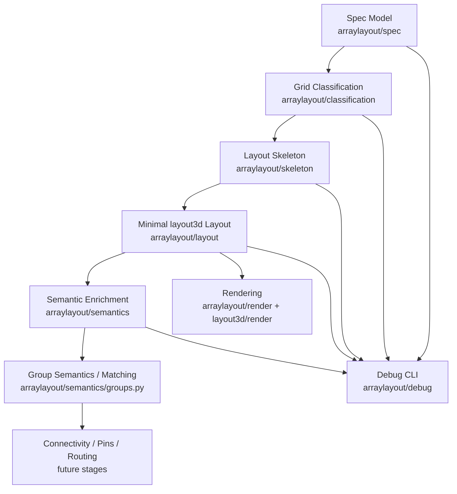

Hier ist eine **Mermaid-Version** für README oder `docs/pipeline.md`:

```mermaid
flowchart TD
    A[Spec Model<br/>arraylayout/spec] --> B[Grid Classification<br/>arraylayout/classification]
    B --> C[Layout Skeleton<br/>arraylayout/skeleton]
    C --> D[Minimal layout3d Layout<br/>arraylayout/layout]
    D --> E[Semantic Enrichment<br/>arraylayout/semantics]
    E --> F[Group Semantics / Matching<br/>arraylayout/semantics/groups.py]
    F --> G[Connectivity / Pins / Routing<br/>future stages]

    D --> R[Rendering<br/>arraylayout/render + layout3d/render]
    A --> DBG[Debug CLI<br/>arraylayout/debug]
    B --> DBG
    C --> DBG
    D --> DBG
    E --> DBG
```

Und etwas detaillierter:

```mermaid
flowchart LR
    subgraph S1[Stage 1: Spec]
        S1A[CapArraySpecModel]
        S1B[ResArraySpecModel]
        S1C[BoundaryDeviceSize]
    end

    subgraph S2[Stage 2: Classification]
        S2A[GeneratedGridClassification]
        S2B[tiles: x,y,layer -> DEVICE/WIRE]
    end

    subgraph S3[Stage 3: Skeleton]
        S3A[GeneratedLayoutSkeleton]
        S3B[GeneratedDeviceStack]
        S3C[GeneratedWireCell]
    end

    subgraph S4[Stage 4: Layout]
        S4A[layout3d.Layout]
        S4B[Device]
        S4C[WireTile]
    end

    subgraph S5[Stage 5: Semantics]
        S5A[EnrichedGeneratedLayout]
        S5B[GeneratedDeviceSemantic]
    end

    S1 --> S2 --> S3 --> S4 --> S5
```

Kopier das direkt in Markdown; GitHub rendert Mermaid inzwischen nativ.
