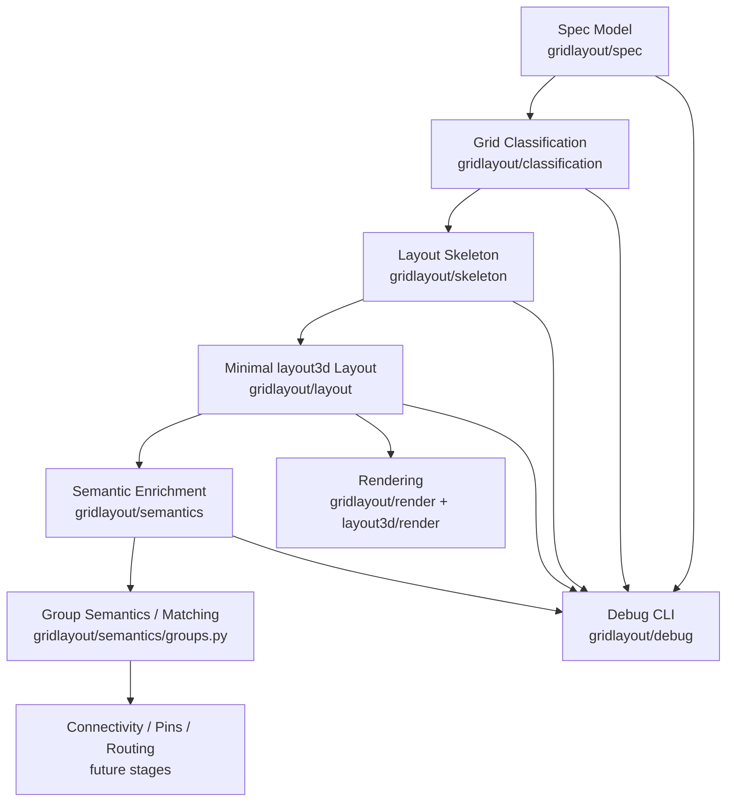

# Array Layout Pipeline

Diese Dokumentation beschreibt die Architektur der Pipeline im Paket `gridlayout` sowie die Rolle des separaten Pakets `layout3d`.

Die Pipeline transformiert eine fachliche Spezifikation (Spec) schrittweise in ein generisches 3D-Layout und ergänzt dieses anschließend um Semantik.

## Überblick

Spec Model
→ Grid Classification
→ Layout Skeleton
→ Minimal layout3d Layout
→ Semantic Enrichment
→ (später) Group Semantics / Matching / Connectivity / Routing

Zusätzliche Querschnittskomponenten:

- Debug / CLI
- Rendering

## Designprinzipien

- Klare Trennung der Verantwortlichkeiten pro Stage
- Keine Rückkopplung früherer Stufen
- Semantik erst nach Geometrie
- Placement ≠ Gruppensemantik
- `layout3d` bleibt generisch und unabhängig

## 1. Spec Model

### Zweck

Beschreibung der fachlichen Struktur:

- Welche Devices existieren?
- Wie sollen sie logisch gruppiert werden?
- Welche Placement-Strategie wird verwendet?

### Pfad

`src/gridlayout/spec/`

### Zentrale Dateien

- `parser.py`
- `validator.py`
- `derive.py`
- `netlist.py`
- `models/`

### Wichtige Klassen

- `CapArraySpecModel`
- `ResArraySpecModel`
- `BoundaryDeviceSize`

### Wichtige Funktionen

- `parse_circuit_array_spec(...)`
- `parse_circuit_array_spec_json(...)`
- `validate_spec(...)`

### Eingabe

JSON / Python-Daten

### Ausgabe

stark typisierte Spec-Modelle

### Was diese Stage nicht tut

- keine Geometrie
- keine Koordinaten
- keine Devices im Layout
- keine Routing-Information

## 2. Grid Classification

### Zweck

Erste Geometrisierung:

Jede Rasterzelle `(x, y, layer)` wird als `DEVICE` oder `WIRE` klassifiziert.

### Pfad

`src/gridlayout/classification/`

### Zentrale Dateien

- `grid.py`
- `cap_array.py`
- `res_array.py`

### Wichtige Klassen

- `GeneratedGridClassification`
- `TileKind`

### Wichtige Funktionen

- `generate_grid_classification(...)`

### Eingabe

Spec-Modell
Layer-Anzahl

### Ausgabe

vollständige Grid-Klassifikation

### Eigenschaften

- vollständige Abdeckung aller Zellen
- keine Überlappungen
- deterministisch

### Was diese Stage nicht tut

- keine Gruppensemantik
- keine Device-Objekte
- keine Pins / Routing
- keine Netze

## 3. Layout Skeleton

### Zweck

Umwandlung der Grid-Klassifikation in eine objektbasierte Struktur:

- Device-Tiles → DeviceStacks
- Wire-Tiles → WireCells

### Pfad

`src/gridlayout/skeleton/`

### Zentrale Dateien

- `models.py`
- `transform.py`

### Wichtige Klassen

- `GeneratedLayoutSkeleton`
- `GeneratedDeviceStack`
- `GeneratedWireCell`

### Wichtige Funktionen

- `classification_to_layout_skeleton(...)`

### Eingabe

`GeneratedGridClassification`

### Ausgabe

`GeneratedLayoutSkeleton`

### Eigenschaften

- DeviceStacks bündeln Layer
- klare Trennung Device vs Wire
- vollständige Grid-Abdeckung bleibt erhalten

### Was diese Stage nicht tut

- keine `layout3d`-Objekte
- keine Semantik
- keine Gruppenzuordnung
- keine Routing-Information

## 4. Minimal layout3d Layout

### Zweck

Übersetzung des Skeletons in das generische Layout-System `layout3d`.

### Pfad

`src/gridlayout/layout/`

### Zentrale Datei

- `build.py`

### Zielsystem

`src/layout3d/`

### Wichtige Funktionen

- `skeleton_to_layout(...)`
- `generate_minimal_layout(...)`

### Eingabe

`GeneratedLayoutSkeleton`

### Ausgabe

`layout3d.Layout`

### Eigenschaften

- erzeugt Device und WireTile
- enthält Platzhalterwerte für:
  - `device_type`
  - `pins`
  - `routing`
- vollständig strukturell, nicht semantisch

### Was diese Stage nicht tut

- keine Device-Semantik
- keine Gruppierung
- keine Netze
- keine Pins

## 5. Semantic Enrichment

### Zweck

Zuweisung fachlicher Bedeutung zu Devices.

### Pfad

`src/gridlayout/semantics/`

### Zentrale Dateien

- `device.py`
- `groups.py` (teilweise / im Aufbau)

### Wichtige Klassen

- `GeneratedDeviceSemantic`
- `EnrichedGeneratedLayout`

### Wichtige Funktionen

- `enrich_layout_semantics(...)`

### Eingabe

Spec
Layout (`layout3d.Layout`)

### Ausgabe

angereichertes Layout
Mapping: `device_id → semantic`

### Typische Semantik

- `family = cap | res`
- `role = core | boundary | dummy`
- `boundary_side`
- `boundary_device_size`
- `group_index`

### Wichtige Regeln

- jedes Device gehört zu genau einer Gruppe
- `group_index` ist immer `int`
- Boundary- und Dummy-Devices gehören zu Gruppe 0
- Gruppenzugehörigkeit ist logisch, nicht geometrisch

### Was diese Stage nicht tut

- keine Netze
- keine Pins
- kein Routing

## 6. Group Semantics (nächster Schritt)

### Zweck

Explizite Modellierung logischer Gruppen:

- Gruppenzugehörigkeit
- erwartete Gruppengröße
- tatsächliche Gruppengröße
- Vollständigkeit

### Pfad

`src/gridlayout/semantics/groups.py`

### Geplante Klassen

- `GeneratedGroupSemantic`
- `GeneratedGroupSemantics`

### Geplante Funktionen

- `derive_group_semantics(...)`

### Wichtige Eigenschaft

Gruppenzugehörigkeit kommt aus dem Spec, nicht aus Placement.

## 7. Debug / CLI

### Zweck

Sichtbarmachung aller Pipeline-Stufen.

### Pfad

`src/gridlayout/debug/`

### Zentrale Dateien

- `helpers.py`
- `cli.py`

### Funktionen

- `debug_spec(...)`
- `debug_grid_classification(...)`
- `debug_layout_skeleton(...)`
- `debug_layout(...)`

### Bedeutung

- erleichtert Debugging
- ermöglicht Snapshot-Tests
- verändert keine Pipeline-Logik

## 8. Rendering

### Zweck

Integration der Pipeline mit dem Rendering-System.

### Pfad

`src/gridlayout/render/`

### Zentrale Datei

- `cli.py`

### Ausgabeformate

- ASCII
- PNG
- HTML

### Abhängigkeit

- `src/layout3d/render.py`
- `src/layout3d/render_html.py`

## 9. layout3d (separates System)

### Zweck

Generisches Layout- und Rendering-System.

### Pfad

`src/layout3d/`

### Wichtige Dateien

- `types.py`
- `representation.py`
- `parser.py`
- `validation.py`
- `normalize.py`
- `render.py`
- `render_html.py`

### Rolle

- definiert Layout-Datenstrukturen
- validiert Layouts
- rendert Layouts

### Wichtiger Punkt

`layout3d` enthält keine Spec- oder Placement-Logik.

## 10. Öffentliche API

### Pfad

`src/gridlayout/__init__.py`

### Ziel

Kleine, bewusste API mit zentralen Einstiegspunkten:

- Spec parsing
- Grid classification
- Skeleton-Erzeugung
- Minimal layout
- Semantic enrichment

### Designprinzip

- wenige Einstiegspunkte
- keine Debug-/Helper-Leaks
- keine `layout3d`-internen Klassen

## Zusammenfassung

Die Pipeline ist klar strukturiert in:

| Ebene | Inhalt |
| --- | --- |
| Spec | fachliche Beschreibung |
| Classification | Geometrie (Device vs Wire) |
| Skeleton | Objektstruktur |
| Layout | generisches Layout (`layout3d`) |
| Semantics | Bedeutung der Devices |

### Architektonischer Merksatz

Intent → Geometrie → Struktur → Layout → Semantik

Diese Struktur erlaubt es, später sauber zu erweitern um:

- Gruppierung
- Matching
- Connectivity
- Pins
- Routing

ohne frühere Stufen zu verändern.

```mermaid
flowchart LR
    subgraph S1[Stage 1: Spec]
        S1A[CapArraySpecModel]
        S1B[ResArraySpecModel]
        S1C[BoundaryDeviceSize]
    end

    subgraph S2[Stage 2: Classification]
        S2A[GeneratedGridClassification]
        S2B[tiles: x,y,layer -> DEVICE/WIRE]
    end

    subgraph S3[Stage 3: Skeleton]
        S3A[GeneratedLayoutSkeleton]
        S3B[GeneratedDeviceStack]
        S3C[GeneratedWireCell]
    end

    subgraph S4[Stage 4: Layout]
        S4A[layout3d.Layout]
        S4B[Device]
        S4C[WireTile]
    end

    subgraph S5[Stage 5: Semantics]
        S5A[EnrichedGeneratedLayout]
        S5B[GeneratedDeviceSemantic]
    end

    S1 --> S2 --> S3 --> S4 --> S5
```

